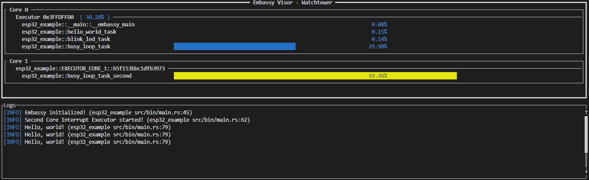

# Embassy Watchtower: ESP32 Example

This project serves as a reference implementation to demonstrate the integration of **Embassy Watchtower** on an **ESP32** microcontroller. 

Scaffolded using `cargo generate`, this example showcases a **dual-core configuration**. It initializes two separate Executors, running tasks independently on both cores of the ESP32 to demonstrate multi-core profiling capabilities.

### Sample Analysis
Below is a visualization of the dual-core task analysis provided by Embassy Visor:

